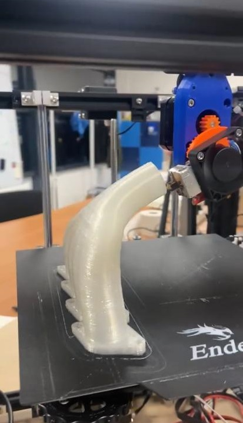

# GCodeBending
 This is a quick and dirty Python code to deform GCode so that it follows a defined spline.
# Requirements
- GCode needs to be sliced with relative extrusions activated, preferably in PrusaSlicer
- You need enough clearance around your nozzle to print significant angles
- The model can't be too large in the X dimension, otherwise you'll get self intersections
- To make use of 4-axis functionality you need an at least 4-axis printer with B-axis (rotates around Y).
# Usage
- Place your part preferably in the middle of your print plate with known center X coordinates
- Place the sliced GCode in the same directory as the Python script
- Set *INPUT_FILE_NAME* to your GCode file name
- Set *LAYER_HEIGHT* to your slicing layer height. Important, because you don't set it correctly you'll get under- or over extrusions
- Set *WARNING_ANGLE* to the maximum angle your system can print at due to clearances
- Define your spline with *SPLINE_X* and *SPLINE_Z*. This array can contain an arbitrary number of points. Make sure the first X-coordinate is in the center of your part. Make sure the last z coordinate is higher or equal the highest z-coordiante in your GCode.
- *SPLINE = CubicSpline(SPLINE_Z, SPLINE_X, bc_type=((1, 0), (1, -np.pi/6)))* defines the spline. You can alter the last pair of of *bc_type* (here *1,-np.pi/6*). This defines the final angle of your spline in RAD.
# 4-axis support
- The original code has been augmented to also output the current layer angle as the B coordinate in the generated G-code.
- This enables printing G-code with extreme bends, using a multi-axis printer.

